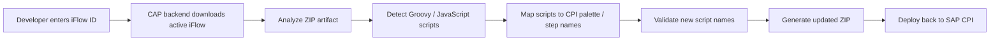
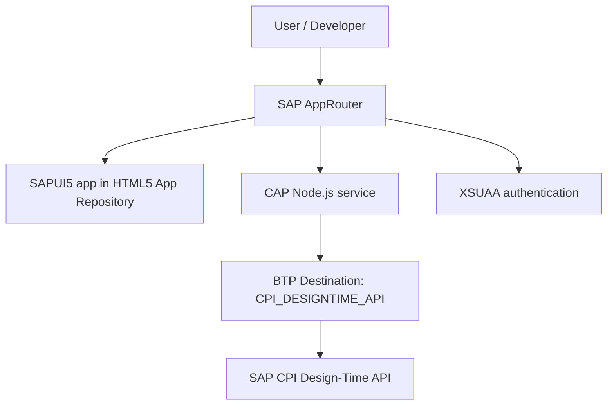
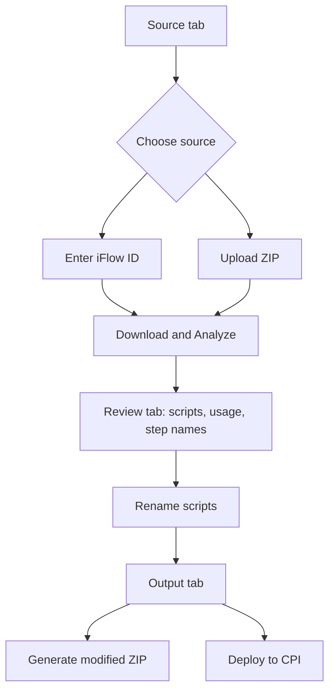

# CPI Utility Hub

CPI Utility Hub is an SAPUI5 + CAP application for SAP Cloud Integration developers. It helps rename Groovy and JavaScript script resources in CPI iFlows without manually downloading, inspecting, editing, and redeploying every artifact.

The app supports two working modes:

| Mode | Purpose |
| --- | --- |
| iFlow ID automation | Fetch an active iFlow from SAP CPI, analyze scripts, rename safely, and deploy back to CPI. |
| ZIP fallback | Upload an exported CPI iFlow ZIP, analyze scripts, rename safely, and download the modified ZIP. |

## Problem

In large CPI packages, one iFlow can contain many script resources. During SIT/UAT, flow steps may change, Groovy palettes may be removed, and script files can remain in the Resources section even when they are no longer used.

Before production movement, developers often need to:

1. Find every script in the iFlow.
2. Check which palette/step is using it.
3. Detect unused scripts.
4. Rename files based on naming standards.
5. Update references inside the iFlow definition.
6. Generate or deploy the corrected artifact.

This is manual, slow, and easy to break in complex flows.

## Solution

CPI Utility Hub turns that maintenance activity into a guided workflow.



## Key Features

| Feature | What it does |
| --- | --- |
| Fetch by iFlow ID | Downloads the active CPI iFlow using SAP Integration Suite design-time APIs. |
| Script detection | Finds Groovy and JavaScript files under CPI script resources. |
| Palette / step mapping | Shows which iFlow step references each script. |
| Usage status | Marks scripts as `Used` or `Unused` based on detected references. |
| Rename validation | Blocks empty names, duplicate names, invalid paths, and missing `.groovy` / `.js` extensions. |
| Reference update | Updates script references inside the iFlow artifact when a script is renamed. |
| Generate ZIP | Builds a corrected CPI artifact for manual download. |
| Deploy to CPI | Uploads the corrected artifact back to SAP CPI through a secure backend flow. |
| Deployment comment | Captures a developer comment before deploy for better operational context. |

## Architecture



### Security Model

| Layer | Responsibility |
| --- | --- |
| SAP AppRouter | Entry point for the deployed application. |
| XSUAA | Handles SAP BTP login / enterprise SSO. |
| Destination Service | Stores CPI OAuth client credentials securely outside the browser. |
| CAP backend | Calls CPI APIs using the destination and processes iFlow artifacts. |
| SAPUI5 frontend | Handles user interaction only; no CPI secrets are stored in browser storage. |

## Project Creation Journey

The project was created in SAP Business Application Studio as a full-stack cloud application.

| Step | Selection / Implementation |
| --- | --- |
| Dev Space | Full Stack Cloud Application |
| Project type | CAP project with SAP Fiori/UI5 frontend |
| Runtime | Node.js |
| Deployment | Cloud Foundry MTA deployment |
| Authentication | SAP BTP XSUAA |
| Routing | SAP AppRouter |
| CPI credential handling | SAP BTP Destination service |
| Frontend hosting | SAP HTML5 Application Repository |
| Backend | CAP service exposing `/api/artifact` |
| ZIP processing | JSZip |
| XML parsing | `@xmldom/xmldom` |
| CPI API calls | SAP Cloud SDK HTTP client |

## Repository Structure

```text
cpi-utility-hub/
|-- app/
|   |-- cpiutilityui/          # SAPUI5 frontend application
|   |-- router/                # SAP AppRouter config
|   |-- services.cds           # UI service references
|-- srv/
|   |-- artifact-service.cds   # CAP service contract
|   |-- artifact-service.js    # ZIP analysis, rename, CPI download/deploy logic
|-- mta.yaml                   # Cloud Foundry MTA deployment descriptor
|-- xs-security.json           # XSUAA security descriptor
|-- package.json               # Node.js dependencies and scripts
|-- readme.md                  # Project documentation
```

## Backend API

The CAP service is exposed at:

```text
/api/artifact
```

| Action | Purpose |
| --- | --- |
| `health()` | Confirms backend is running. |
| `downloadFromCpi(iflowId)` | Downloads the active iFlow from CPI. |
| `analyzeArtifact(fileName, zipBase64)` | Scans scripts and usage references. |
| `generateArtifact(fileName, zipBase64, renames)` | Builds a modified ZIP with renamed scripts and updated references. |
| `deployToCpi(iflowId, zipBase64, comment)` | Deploys the modified artifact back to CPI. |

## Frontend Flow



## Local Development

Install dependencies:

```bash
npm ci
```

Run without CPI destination binding, useful for ZIP-only testing:

```bash
cds watch
```

Run with BTP destination binding, required for CPI download/deploy:

```bash
cf login --sso
cf target -o <org> -s <space>
cds bind -2 cpi-utility-hub-destination
cds bind --exec "cds watch"
```

If `cds bind --exec` behaves differently in BAS, start the hybrid profile after binding:

```bash
cds watch --profile hybrid
```

Open the UI locally:

```text
https://port4004-<bas-host>/cpiutilityui/webapp/
```

## Destination Configuration

Create a destination in the same BTP subaccount where the app runs.

| Property | Value |
| --- | --- |
| Name | `CPI_DESIGNTIME_API` |
| Type | `HTTP` |
| Proxy Type | `Internet` |
| Authentication | `OAuth2ClientCredentials` |
| URL | `https://<cpi-tenant-host>/api/v1` |
| Token Service URL | `https://<uaa-host>/oauth/token` |
| Token Service URL Type | `Dedicated` |
| Client ID | From CPI API service key |
| Client Secret | From CPI API service key |

The destination name must match the backend constant:

```js
const CPI_DESTINATION = "CPI_DESIGNTIME_API";
```

## Deployment

Build the MTA archive:

```bash
mbt build
```

Deploy to Cloud Foundry:

```bash
cf deploy mta_archives/cpi-utility-hub_1.0.0.mtar
```

If your build script creates `archive.mtar`, deploy that file instead:

```bash
cf deploy mta_archives/archive.mtar
```

Find the app URL:

```bash
cf apps
```

Open the route for:

```text
cpi-utility-hub
```

The backend app is:

```text
cpi-utility-hub-srv
```

## AppRouter Route Setup

The deployed app needs the API route before the HTML5 fallback route.

```json
{
  "source": "^/api/(.*)$",
  "target": "/api/$1",
  "destination": "srv-api",
  "authenticationType": "xsuaa",
  "csrfProtection": false
}
```

If this route is missing or placed after the fallback route, deployed POST calls can return plain `Forbidden`, causing the UI to show:

```text
Unexpected token 'F', "Forbidden" is not valid JSON
```

## Production Notes

| Area | Recommendation |
| --- | --- |
| User access | Assign users through BTP/XSUAA role collections. |
| CPI credentials | Store only in Destination service, never in frontend code. |
| Audit | Use CPI version history and deployment comments for traceability. |
| Test flows | Validate deploy with a safe non-production iFlow first. |
| Source control | Do not commit `.cdsrc-private.json`, service keys, secrets, generated folders, or MTAR files. |

## Troubleshooting

### XSUAA `xsappname` exceeds 100 characters

If deployment fails because `xsappname` is longer than 100 characters, shorten it in `mta.yaml`:

```yaml
xsappname: cpiutilhub
```

Then rebuild and redeploy.

### Application Logging plan not found

Some trial tenants do not provide the `application-logs` `standard` plan. The logging service is optional for this utility. Remove the logging resource and module references from `mta.yaml`, then redeploy.

### Local binding points to old tenant region

If local BAS says the current Cloud Foundry endpoint differs from the service binding endpoint, remove local binding cache and bind again:

```bash
rm -f .cdsrc-private.json ~/.cds-services.json
cf target
cds bind -2 cpi-utility-hub-destination
cds bind --exec "cds watch"
```

### Deployed app works for login but CPI action fails

Check backend logs:

```bash
cf logs cpi-utility-hub-srv --recent
```

If no `/api/artifact/...` request reaches the backend, verify `app/router/xs-app.json`.

## What This Project Demonstrates

- SAP CPI artifact automation.
- SAPUI5/Fiori-style frontend development.
- CAP Node.js backend design.
- Secure BTP Destination usage.
- XSUAA and AppRouter based authentication.
- Cloud Foundry MTA deployment.
- Practical developer productivity improvement for SAP Integration Suite teams.

## Future Scope

- Role-based admin/user access.
- Better deployment audit comments if supported by CPI APIs.
- Extended unused resource detection for mappings, schemas, and other artifact resources.
- Bulk iFlow analysis for packages.
- Naming-standard templates for different teams.
- Transport-ready governance checks before production movement.
